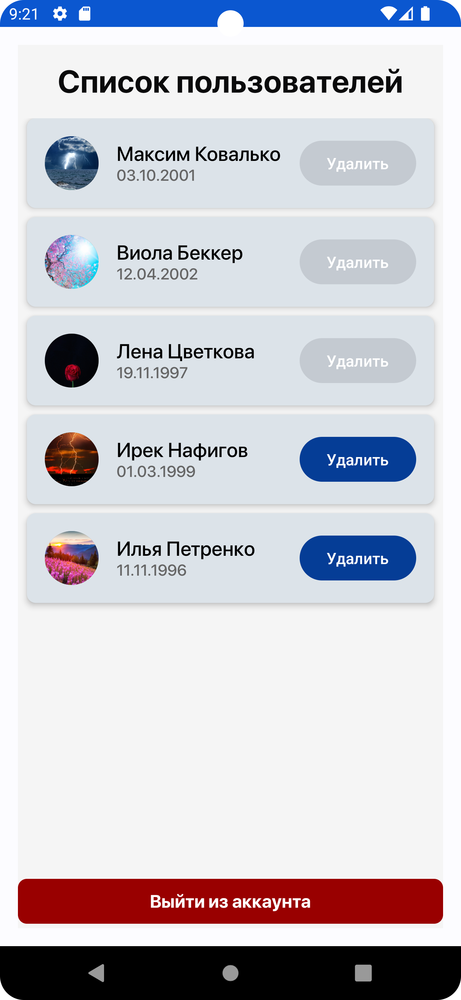

# Registration

## Описание

Добро пожаловать в приложение Registration! Это тестовое задание для Android-разработчика в лабораторию ZenCar.tech. Приложение представляет собой электронную очередь людей и состоит из двух экранов:

- **Экран регистрации и авторизации**
- **Экран со списком пользователей**

## Скриншоты

## Функциональность

### Экран регистрации и авторизации

- **Регистрация**: Пользователь вводит имя, дату рождения и пароль. После успешной регистрации пользователь переходит на экран со списком пользователей.
- **Авторизация**: Пользователь вводит имя и пароль. После успешной авторизации пользователь переходит на экран со списком пользователей.
- **Переключение**: Возможность переключения между формами регистрации и авторизации.
- **Запоминание состояния**: После успешной регистрации/авторизации пользователь больше не попадает на первый экран, пока не выйдет из аккаунта, даже при перезапуске приложения.

### Экран со списком пользователей

- **Информация о пользователе**: Отображается вся сохраненная информация об авторизованном пользователе.
- **Кнопка выхода**: Возможность выхода из аккаунта.
- **Список пользователей**: Отображается список всех зарегистрированных пользователей, отсортированный по дате регистрации.
- **Удаление пользователей**: Авторизованный пользователь может удалять аккаунты других пользователей, зарегистрировавшихся позже него.
- **Аватарка**: Возможность добавить аватарку при регистрации.

## Технические требования

- **Язык**: Kotlin
- **UI**: Jetpack Compose
- **Сборка**: Gradle (KTS)
- **База данных**: Room
- **Многопоточность**: Coroutines
- **Архитектура**: MVI
- **Принципы**: SOLID/Clean

## Дополнительные улучшения

- Использование Coil для загрузки изображений.
- Обработка ошибок и валидация форм.
- Улучшенный пользовательский интерфейс.
